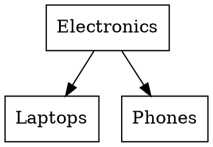

# Tree Exporters

Read-only formatters that render a node (or whole forest) as Mermaid, Graphviz DOT, ASCII tree, or nested JSON. Useful for:

- **Debugging.** `dd($root->toAsciiTree())` when a tree assertion fails.
- **Docs.** Paste a `toMermaid()` snippet into a markdown file and GitHub renders the diagram.
- **Frontend handoff.** `toJsonTree()` returns the shape `jsTree`, `react-arborist`, and `vue-tree` accept directly.

Every exporter is a pure function of state already on the model — no mutation, no schema changes. Each instance method runs **one** `lft`-ordered query for the subtree, then folds in PHP.

## ASCII tree

```php
use Vusys\NestedSet\Export\AsciiOptions;

echo $electronics->toAsciiTree();
// Electronics
// ├── Laptops
// └── Phones
//     ├── iPhone
//     └── Android

echo $electronics->toAsciiTree(new AsciiOptions(unicode: false));
// Electronics
// |-- Laptops
// `-- Phones
//     |-- iPhone
//     `-- Android
```

`AsciiOptions` knobs:

| Field | Type | Default | What it does |
| --- | --- | --- | --- |
| `unicode` | `bool` | `true` | Box-drawing glyphs (`├ └ │`) vs plain ASCII (`\|-- \`-- \|   `). |
| `label` | `Closure(Model): string\|int\|float\|null` | `fn ($n) => $n->name` | Render each row. Falls back to the primary key if the closure throws or returns null. |
| `showDepth` | `bool` | `false` | Append `(depth=N)` to each label. |
| `maxDepth` | `?int` | `null` | Truncate beyond depth N (counted from the export root). Composes with `filter` — the stricter depth wins. |
| `withTrashed` | `bool` | `false` | Include soft-deleted descendants. |
| `filter` | `?WalkFilter` | `null` | Predicate-based pruning. See [Walking Subtrees → Pruning with `WalkFilter`](walking.md#pruning-with-walkfilter). |

## Mermaid

```php
use Vusys\NestedSet\Export\MermaidOptions;

echo $electronics->toMermaid();
// graph TD
//     n1["Electronics"]
//     n2["Laptops"]
//     n3["Phones"]
//     n4["iPhone"]
//     n5["Android"]
//     n1 --> n2
//     n1 --> n3
//     n3 --> n4
//     n3 --> n5
```

Paste the output into a markdown ` ```mermaid ` block and GitHub renders it. Direction defaults to `TD` (top-down); pass `LR`, `BT`, or `RL` to flip.

Aggregate columns can ride along on each label:

```php
$electronics->toMermaid(new MermaidOptions(
    showAggregates: ['products_total', 'products_count'],
));
// graph TD
//     n1["Electronics<br/>products_total: 23<br/>products_count: 17"]
//     ...
```

`MermaidOptions` knobs:

| Field | Type | Default | What it does |
| --- | --- | --- | --- |
| `direction` | `'TD'\|'LR'\|'BT'\|'RL'` | `'TD'` | Graph direction. |
| `label` | `Closure(Model): ...` | `fn ($n) => $n->name` | Per-node label. |
| `showId` | `bool` | `false` | Append `(id=N)` to each label. |
| `showAggregates` | `list<string>` | `[]` | Aggregate columns appended as extra label lines. |
| `withTrashed` | `bool` | `false` | Include soft-deleted descendants. |
| `filter` | `?WalkFilter` | `null` | Predicate-based pruning. See [Walking Subtrees → Pruning with `WalkFilter`](walking.md#pruning-with-walkfilter). |

Special characters in labels are HTML-escaped (`"` → `&quot;`, `<` → `&lt;`, newlines → `<br/>`). UUID primary keys hash to a short alphanumeric prefix (`n4a91f2c0`) so the identifiers stay valid Mermaid syntax.

## Graphviz / DOT

```php
use Vusys\NestedSet\Export\DotOptions;

file_put_contents('tree.dot', $electronics->toDot());
// dot -Tpng tree.dot -o tree.png
```

Output:



`DotOptions` mirrors `MermaidOptions` (direction defaults to `TB`, and the same `filter: ?WalkFilter` field is supported). Quotes and backslashes in labels are DOT-escaped.

## JSON

```php
use Vusys\NestedSet\Export\JsonOptions;

return response()->json($electronics->toJsonTree());
```

Output shape:

```json
{
    "id": 1,
    "label": "Electronics",
    "children": [
        { "id": 2, "label": "Laptops", "children": [] },
        {
            "id": 3,
            "label": "Phones",
            "children": [
                { "id": 4, "label": "iPhone", "children": [] },
                { "id": 5, "label": "Android", "children": [] }
            ]
        }
    ]
}
```

The method is named `toJsonTree()` (not `toJson()`) because Eloquent already defines `Model::toJson(int $options)` for serialising one row.

`JsonOptions` knobs:

| Field | Type | Default | What it does |
| --- | --- | --- | --- |
| `label` | `Closure(Model): ...` | `fn ($n) => $n->name` | Per-node label. |
| `extras` | `list<string>` | `[]` | Raw column names to copy onto each payload (e.g. `['lft', 'rgt', 'depth']`). |
| `childrenKey` | `string` | `'children'` | Rename the children array key (`'items'`, `'nodes'`, …). |
| `withTrashed` | `bool` | `false` | Include soft-deleted descendants. |
| `filter` | `?WalkFilter` | `null` | Predicate-based pruning. See [Walking Subtrees → Pruning with `WalkFilter`](walking.md#pruning-with-walkfilter). |

## Whole-tree exports

The instance methods above render `$node` + its descendants. To export **every** root in the table, use the `*Forest` static methods:

```php
Category::toMermaidForest();
Category::toDotForest();
Category::toAsciiTreeForest();
Category::toJsonTreeForest();
```

> [!WARNING]
> `toJsonTreeForest()` returns a **single root dict when exactly one root exists, and a list of root dicts when there's more than one** — the shape depends on the data. Callers that pass the result straight to a frontend that expects a stable contract will break the first time a second root appears. Normalise with `array_values((array) $result)` if you want a list always, or assert `count($roots) === 1` upstream. The instance `toJsonTree()` always returns a single dict (one node, one tree); the shape problem only applies to the forest variant.

## Scoped (multi-tree) models

For models that declare `#[NestedSetScope(...)]`, the `*Forest` variants walk every tree across every scope. To render just one tree, pass the scope value:

```php
MenuItem::toMermaidScope(7);
MenuItem::toAsciiTreeScope(7, new AsciiOptions(unicode: false));
```

Multi-column scopes accept an array:

```php
Comment::toMermaidScope(['tenant_id' => 42, 'post_id' => 99]);
```

Calling `*Scope` on an unscoped model throws `LogicException` — use the `*Forest` variant instead.

## Edge cases

- **Soft deletes.** Excluded by default. Pass `withTrashed: true` on any options object to include them; combine with a custom `label` closure if you want to mark them visually (`[deleted] {$name}`).
- **Unplaced node** (`lft = rgt = 0`). The descendants query returns nothing, so the export is just the root row.
- **Cyclic `parent_id`.** Detected during the fold; throws `Vusys\NestedSet\Exceptions\CorruptTreeException` rather than infinite-looping. This only triggers on corrupt data — see [Tree Repair](../maintenance/fix-tree.md).
- **Label fallback.** If the `label` closure throws or returns `null` / `''` / a non-stringable object, the renderer falls back to the primary key.
- **Large trees.** The exporters are debug / UI tools, not analytics pipelines — they load the whole subtree into memory. Use `maxDepth` for ASCII rendering, or paginate by anchor for forests larger than ~10k nodes.
